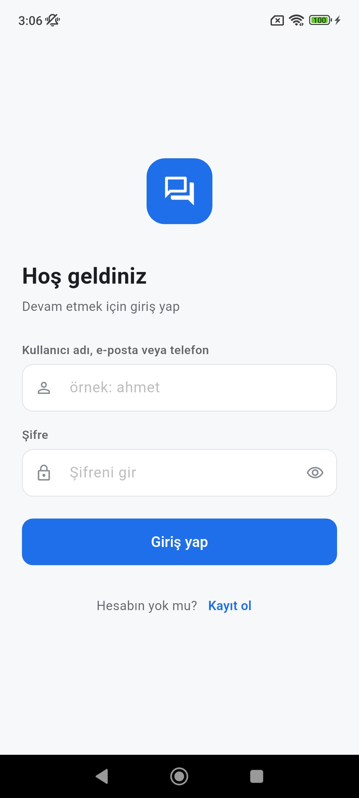
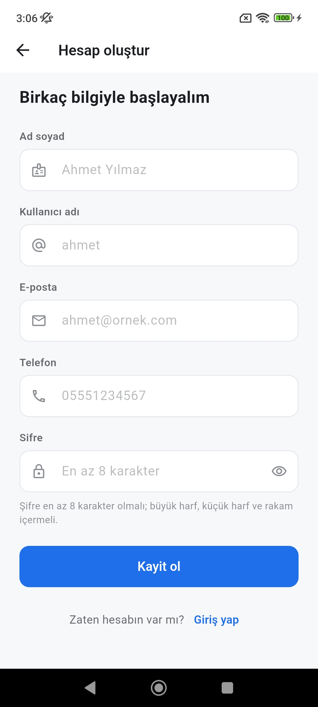
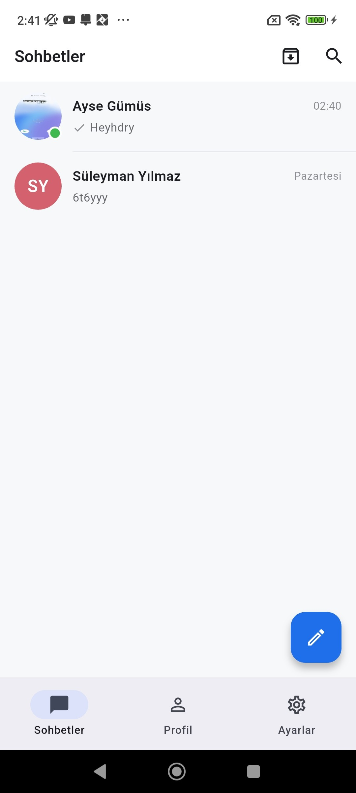
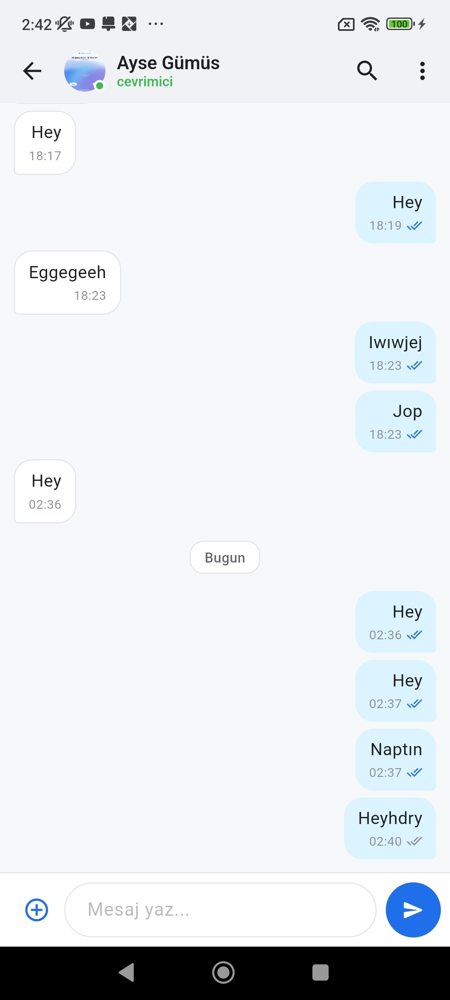
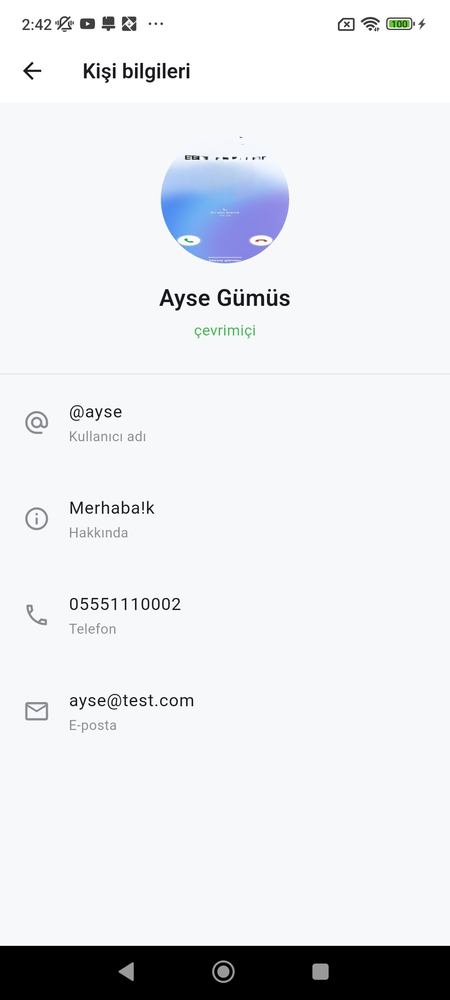
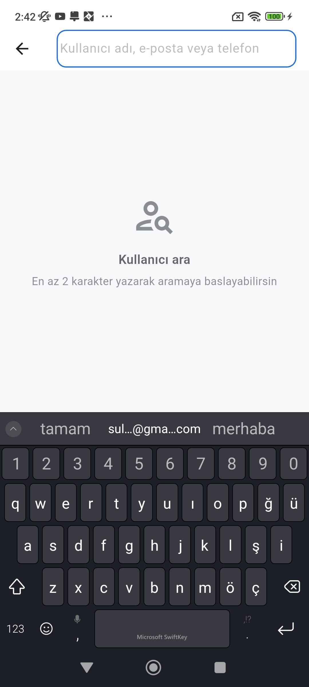
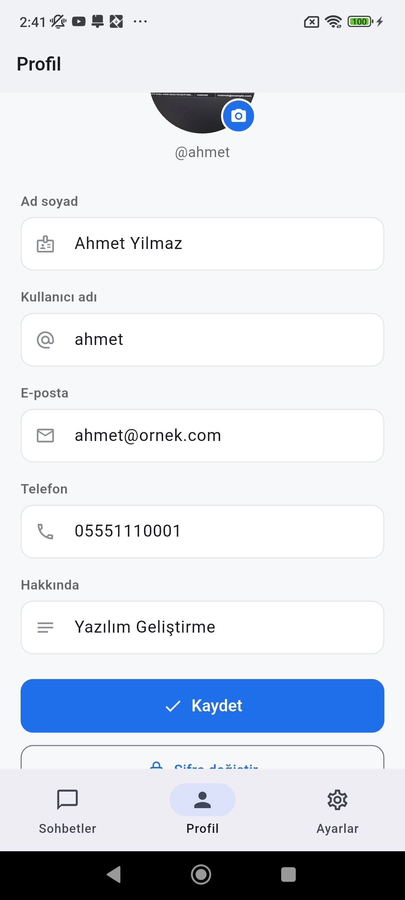
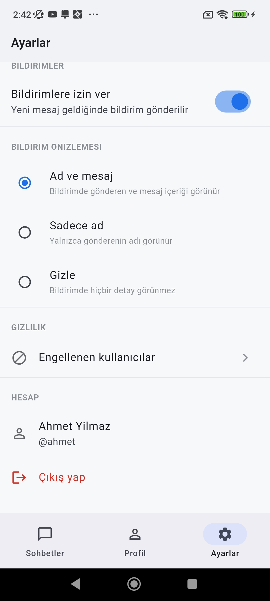
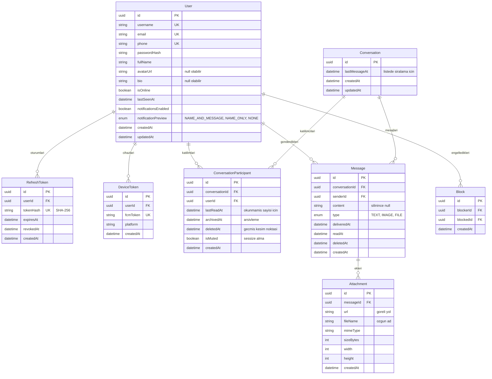

# Lafla

WhatsApp benzeri, birebir mesajlaşma uygulaması. Flutter mobil istemci ve
Node.js/Express backend'den oluşur; mesajlar PostgreSQL'de kalıcı olarak saklanır,
gerçek zamanlı iletim Socket.IO ile, uygulama kapalıyken bildirimler Firebase Cloud
Messaging ile yapılır.

Staj projesi olarak geliştirilmiştir.

## İçindekiler

- [Projenin amacı](#projenin-amacı)
- [Ekran görüntüleri](#ekran-görüntüleri)
- [Özellikler](#özellikler)
- [Kullanılan teknolojiler](#kullanılan-teknolojiler)
- [Proje yapısı](#proje-yapısı)
- [Backend mimarisi](#backend-mimarisi)
- [Frontend mimarisi](#frontend-mimarisi)
- [Veritabanı tercihi ve gerekçesi](#veritabanı-tercihi-ve-gerekçesi)
- [Veritabanı şeması (ER diyagramı)](#veritabanı-şeması-er-diyagramı)
- [Kimlik doğrulama yapısı](#kimlik-doğrulama-yapısı)
- [Gerçek zamanlı iletişim altyapısı](#gerçek-zamanlı-iletişim-altyapısı)
- [API uç noktaları](#api-uç-noktaları)
- [Kurulum](#kurulum)
- [Ortam değişkenleri](#ortam-değişkenleri)
- [Çalıştırma](#çalıştırma)
- [Örnek kullanıcılar](#örnek-kullanıcılar)
- [Örnek API istekleri](#örnek-api-istekleri)
- [Testler](#testler)
- [Karşılaşılan problemler ve çözümleri](#karşılaşılan-problemler-ve-çözümleri)
- [Önemli teknik kararlar](#önemli-teknik-kararlar)

## Projenin amacı

Kullanıcıların sisteme kayıt olup birbirlerini bulabildiği, birebir mesajlaşabildiği,
mesaj geçmişini görüntüleyebildiği ve profil işlemlerini yapabildiği bir mobil
mesajlaşma uygulaması geliştirmek.

Uygulama yalnızca arayüz olarak değil, gerçek bir backend ve veritabanıyla çalışan
uçtan uca bir sistem olarak kurgulanmıştır.

## Ekran görüntüleri

| Giriş | Kayıt | Sohbet listesi |
|:---:|:---:|:---:|
|  |  |  |
| **Mesajlaşma** | **Mesaj arama** | **Kişi bilgileri** |
|  |  |  |
| **Kullanıcı arama** | **Profil** | **Ayarlar** |
|  |  |  |

## Özellikler

**Kimlik ve hesap**

- Kayıt, giriş, çıkış; kullanıcı adı, e-posta **veya** telefon numarasıyla giriş
- JWT tabanlı kimlik doğrulama, refresh token rotasyonu ve yeniden kullanım tespiti
- Şifreler bcrypt ile hash'lenerek saklanır
- Profil görüntüleme ve güncelleme, profil fotoğrafı yükleme/kaldırma
- Kullanıcı adı, e-posta ve telefon değişikliğinde mevcut şifre doğrulaması
- Çevrimiçi/çevrimdışı durumu ve son görülme bilgisi

**Kişiler**

- Kullanıcı adı, ad soyad, e-posta veya telefonla kullanıcı arama
- Kişi kartında iletişim bilgileri ve durum
- Kullanıcı engelleme ve engellenenler listesi

**Mesajlaşma**

- Birebir metin mesajlaşma, kalıcı mesaj geçmişi
- Mesaj durumları: gönderiliyor, gönderildi, iletildi, okundu
- Gerçek zamanlı iletim, yazıyor göstergesi, okundu bilgisi
- İmleç tabanlı sayfalama ile geçmişe kaydırma
- Sohbet içinde mesaj arama
- Mesaj silme, kopyalama, uzun basma menüsü
- Sohbet silme (kesim noktası mantığıyla), arşivleme, sessize alma
- Görsel ve dosya gönderimi

**Bildirimler**

- Firebase Cloud Messaging ile uygulama arka plandayken ve kapalıyken bildirim
- Bildirim önizleme ayarı: ad ve mesaj / yalnızca ad / içerik gösterme
- Sessize alınan sohbetler için bildirim gönderilmez

**Durum yönetimi**

- Yükleniyor, hata ve boş liste durumları her ekranda ayrı ayrı ele alınır
- Sunucu bağlantısı koptuğunda ekranın üstünde uyarı şeridi belirir
- Gönderilemeyen mesaj hata durumuyla gösterilir ve yeniden denenebilir

## Kullanılan teknolojiler

**Backend**

| Teknoloji | Sürüm | Amaç |
|---|---|---|
| Node.js | 24.x | Çalışma ortamı (ESM) |
| Express | 4.x | HTTP sunucusu ve yönlendirme |
| PostgreSQL | 18.x | Veritabanı |
| Prisma | 6.x | ORM ve migration yönetimi |
| Socket.IO | 4.x | Gerçek zamanlı iletişim |
| Zod | 4.x | İstek doğrulama |
| jsonwebtoken | 9.x | JWT üretimi ve doğrulaması |
| bcrypt | 6.x | Şifre hash'leme |
| multer + sharp | 2.x / 0.35 | Dosya yükleme ve görsel işleme |
| firebase-admin | 14.x | Push bildirim gönderimi |
| helmet, express-rate-limit | 8.x / 7.x | Güvenlik başlıkları, istek sınırı |
| winston | 3.x | Loglama |

**Mobil**

| Teknoloji | Sürüm | Amaç |
|---|---|---|
| Flutter | 3.47 | Mobil uygulama çatısı |
| Riverpod | 2.6 | Durum yönetimi |
| go_router | 14.x | Yönlendirme ve yetki yönlendirmesi |
| dio | 5.x | HTTP istemcisi |
| flutter_secure_storage | 9.x | Token saklama |
| socket_io_client | 2.x | Socket.IO istemcisi |
| firebase_messaging | 15.x | FCM |
| flutter_local_notifications | 18.x | Ön planda bildirim gösterimi |
| cached_network_image | 3.x | Görsel önbellekleme |
| image_picker, file_picker | 1.x / 8.x | Galeri ve dosya seçimi |

## Proje yapısı

```
chat-app/
├── backend/
│   ├── prisma/
│   │   ├── migrations/        veritabanı migration'ları
│   │   ├── schema.prisma      veri modeli
│   │   └── seed.js            örnek veri
│   ├── src/
│   │   ├── config/            env, veritabanı, socket, cors, firebase
│   │   ├── routes/            uç nokta tanımları
│   │   ├── controllers/       istek/yanıt katmanı
│   │   ├── services/          iş mantığı
│   │   ├── repositories/      veritabanı erişimi
│   │   ├── middlewares/       auth, doğrulama, hata, yükleme, istek sınırı
│   │   ├── validators/        Zod şemaları
│   │   ├── sockets/           socket olay yayıncıları
│   │   ├── utils/             ApiError, token, telefon, logger
│   │   ├── app.js             Express uygulaması
│   │   └── server.js          HTTP + Socket.IO sunucusu
│   └── tests/                 entegrasyon testleri
├── mobile/
│   ├── lib/
│   │   ├── core/              yapılandırma, ağ, depolama, tema, yardımcılar
│   │   ├── data/              modeller, veri kaynakları, repository'ler
│   │   └── presentation/      ekranlar, widget'lar, provider'lar
│   └── test/                  widget ve birim testleri
├── docs/
│   └── API.md                 API dokümantasyonu
├── DECISIONS.md               günlük teknik karar kaydı
└── README.md
```

## Backend mimarisi

Katmanlı bir yapı kullanılır ve her istek aynı zinciri izler:

```
route → middleware (auth, validation) → controller → service → repository → Prisma
```

| Katman | Sorumluluk |
|---|---|
| **routes** | Yol tanımı, hangi middleware'lerin çalışacağı |
| **middlewares** | Kimlik doğrulama, Zod doğrulaması, dosya yükleme, istek sınırı, hata yönetimi |
| **controllers** | İsteği okur, servisi çağırır, HTTP durum kodunu belirler |
| **services** | İş mantığı. HTTP'den bağımsızdır, `req`/`res` almaz |
| **repositories** | Yalnızca veritabanı sorguları |

Servis katmanının HTTP'den bağımsız tutulması bilinçlidir: mesaj gönderme mantığı hem
REST ucundan hem de gerekirse bir socket işleyicisinden aynı kaynaktan çağrılabilir.

**Hata yönetimi.** Tüm hatalar tek bir merkezi `errorHandler` üzerinden geçer. Asenkron
denetleyiciler `asyncHandler` ile sarmalanır, böylece `try/catch` tekrarına gerek kalmaz.
`ApiError` sınıfı HTTP durum kodunu ve makine tarafından okunabilir bir `code` değerini
birlikte taşır; Prisma hataları (P2002, P2025, P2003) kullanıcı dostu mesajlara çevrilir.
Ham veritabanı hataları şema yapısını ele verdiği için asla doğrudan döndürülmez.

**Doğrulama.** Gövde, parametre ve sorgu dizesi Zod şemalarıyla doğrulanır. Ortam
değişkenleri de aynı şekilde açılışta doğrulanır; eksik `.env` durumunda uygulama
çalışma zamanında anlaşılmaz bir hata yerine başlangıçta açık bir mesajla durur.

**Güvenlik.** helmet ile güvenlik başlıkları, yapılandırılabilir CORS, istek sınırlama,
bcrypt (maliyet 10) ile şifre saklama, tüm korumalı uçlarda token kontrolü.

## Frontend mimarisi

Üç katmanlı bir yapı kullanılır:

```
presentation (ekranlar, widget'lar, provider'lar)
     ↓
data (repository'ler, veri kaynakları, modeller)
     ↓
core (ağ, depolama, yapılandırma, tema)
```

**Durum yönetimi: Riverpod.** Ekranlar veriyi doğrudan repository'den değil,
provider'lardan okur. Sohbet başına mesaj durumu `family` + `autoDispose` ile tutulur,
böylece açık olmayan sohbetlerin durumu bellekte kalmaz.

**Yönlendirme: go_router.** Oturum durumu router seviyesinde dinlenir; token yoksa
korumalı rotalar giriş ekranına yönlendirilir. Giriş yapmadan mesajlaşma ekranlarına
erişilemez.

**Ağ katmanı.** `dio` üzerine kurulu tek bir istemci; interceptor access token'ı ekler,
`401` alındığında refresh akışını tek seferlik çalıştırıp isteği yeniler. Token'lar
`flutter_secure_storage` ile saklanır.

**İyimser arayüz (optimistic UI).** Gönderilen mesaj, sunucudan yanıt beklenmeden
listede "gönderiliyor" durumuyla görünür. Mesaj kimliği istemcide UUID olarak üretilir;
sunucu yanıtı geldiğinde kayıt yerinde güncellenir, hata olursa yeniden deneme düğmesi
gösterilir.

**Ekranlar:** Splash, Giriş, Kayıt, Ana kabuk (Sohbetler / Profil / Ayarlar sekmeleri),
Sohbet listesi, Mesajlaşma, Kişi detayı, Görsel önizleme, Kullanıcı arama, Arşiv,
Profil, Şifre değiştirme, Ayarlar, Engellenen kullanıcılar.

## Veritabanı tercihi ve gerekçesi

**PostgreSQL seçildi.**

- **Veri modeli baştan sona ilişkisel.** User, Conversation, Message ve Attachment
  arasında net foreign key ilişkileri var. Bu ilişkileri veritabanı seviyesinde zorunlu
  kılmak, tutarsız kayıtların oluşmasını baştan engelliyor.
- **Transaction desteği.** Yeni sohbette ilk mesaj gönderimi üç ayrı yazma işlemi
  gerektiriyor (Conversation + iki ConversationParticipant + Message). Bunların atomik
  olması gerekiyor; yarıda kalan bir istek katılımcısız bir sohbet bırakırdı.
- **Sorgu esnekliği.** Okunmamış mesaj sayısı, son mesaj ve karşı taraf bilgisini tek
  sorguda toplamak ilişkisel bir veritabanında doğrudan ifade edilebiliyor.
- **Mesaj arama** için metin arama desteği hazır geliyor.

MongoDB, sohbet belgesine mesajları gömme modeliyle okuma tarafında avantajlı olurdu;
ancak birebir sohbette mesaj sayısı sınırsız büyüdüğü için belge boyutu sorun olur ve
"okundu" gibi kullanıcıya özel alanlar için yine ayrı bir yapı gerekirdi.

**ORM olarak Prisma kullanıldı.** Şema tek dosyada tanımlanıyor, migration'lar
versiyonlanıyor ve tip güvenli sorgu istemcisi şemadan üretiliyor.

## Veritabanı şeması (ER diyagramı)



Tasarımla ilgili dört karar açıklama gerektiriyor:

**`ConversationParticipant` ara tablosu, `user1Id`/`user2Id` yerine.** Arşivleme,
sessize alma, okundu ve silme bilgisi sohbete değil, *kullanıcı-sohbet ilişkisine* ait.
İki kolonlu yaklaşımda bu bilgiler için kullanıcı başına ayrı kolon açmak ve kodda
sürekli "bu kullanıcı birinci mi ikinci mi" kontrolü yapmak gerekirdi. Ara tablo ayrıca
sorguyu basitleştiriyor ve ileride grup desteğine açık bırakıyor.

**`Message` tablosunda `receiverId` yok.** Alıcı, `conversationId` üzerinden
katılımcılardan çıkarılabiliyor. Ayrıca tutmak veri tekrarı olur ve iki kaynak
çeliştiğinde tutarsızlık doğururdu.

**Mesaj durumu ayrı tablo yerine `deliveredAt`/`readAt` damgalarıyla tutuluyor.**
Birebir sohbette her mesajın tek alıcısı var; ayrı bir `MessageStatus` tablosu Message
ile birebir ilişki kurar ve her sorguya gereksiz bir JOIN ekler. Damga yaklaşımı hem
durumu hem zamanı tek satırda taşıyor.

**Birincil anahtar olarak UUID.** Artan tamsayı kimlikler tahmin edilebilir olduğu için
yetkisiz erişim denemelerine açık. UUID ayrıca istemci tarafında üretilebildiği için
iyimser arayüzü mümkün kılıyor.

## Kimlik doğrulama yapısı

| Token | Süre | Doğrulama | Saklanma |
|---|---|---|---|
| Access token | 15 dakika | Durumsuz (imza) | Yalnızca istemcide |
| Refresh token | 7 gün | Veritabanından | Sunucuda SHA-256 özeti |

Access token her istekte kullanıldığı için durumsuz doğrulanır, veritabanına gidilmez.
Refresh token ise iptal edilebilir olmalı; bu yüzden özeti veritabanında tutulur. Düz
metin saklanmaz — veritabanı sızsa bile token'lar doğrudan kullanılamaz.

**Rotasyon.** Her yenilemede eski refresh token iptal edilir, yenisi verilir.

**Yeniden kullanım tespiti.** İptal edilmiş bir refresh token tekrar kullanılırsa
token'ın çalınmış olabileceği varsayılır ve o kullanıcının **tüm** refresh token zinciri
iptal edilir. Bu davranış `tests/auth.test.js` içinde doğrulanmaktadır.

**Şifre saklama.** bcrypt, maliyet faktörü 10. Şifre hiçbir API yanıtında yer almaz.

**Yetkilendirme.** Korumalı uçlarda token kontrolü yapılır. Kaynak bazlı yetki
kontrolünde çoğunlukla `403` yerine `404` döndürülür: katılımcısı olmadığınız bir
sohbetin varlığını öğrenmeniz bile bilgi sızıntısıdır.

## Gerçek zamanlı iletişim altyapısı

**Socket.IO seçildi.** Ham WebSocket yerine tercih edilmesinin nedenleri:

- **Otomatik yeniden bağlanma.** Mobil ağlarda bağlantı sık kopuyor; ham WebSocket'te
  bu mantığın elle yazılması gerekirdi.
- **Oda (room) kavramı.** Kullanıcı birden fazla cihazdan bağlanabildiği için yayının
  tek bir socket'e değil kullanıcının tüm bağlantılarına gitmesi gerekiyor.
- **Olay tabanlı API.** Mesaj tipi ayrımı için elle protokol tanımlamak gerekmiyor.
- **El sıkışma sırasında kimlik doğrulama.** Token handshake'te doğrulanıyor,
  doğrulanamayan bağlantı hiç kurulmuyor.

İki tür oda kullanılır: `user:<userId>` odasına kullanıcı bağlandığında otomatik
katılır; `conversation:<id>` odasına ise yalnızca sohbet ekranı açıkken katılır ve
yalnızca o ekranda anlamlı olan olaylar (yazıyor göstergesi) buraya yayınlanır.

**Mesaj gönderimi socket üzerinden yapılmaz, REST ile yapılır.** Socket yalnızca iletim
kanalıdır. Böylece doğrulama, hata yönetimi ve HTTP durum kodları tek yerde kalır;
socket bağlantısı kopmuş olsa bile mesaj gönderilebilir.

**Çevrimiçi durumu** bağlantı sayacıyla tutulur: aynı kullanıcı iki cihazdan bağlıysa
biri kapandığında hâlâ çevrimiçi sayılır, sayaç sıfıra indiğinde çevrimdışı işaretlenir
ve `lastSeenAt` güncellenir.

**Bildirimle ilişkisi.** Mesaj gönderildiğinde alıcının bağlı olup olmadığına bakılır.
Bağlıysa mesaj doğrudan iletilir ve "iletildi" işaretlenir; değilse FCM bildirimi
gönderilir.

Olayların tam listesi için: [docs/API.md](docs/API.md#socketio-olayları)

## API uç noktaları

Toplam 32 uç nokta beş grupta toplanır. Tam dokümantasyon, istek/yanıt örnekleri ve hata
kodları için: **[docs/API.md](docs/API.md)**

| Grup | Uç sayısı | Kapsam |
|---|---|---|
| `/auth` | 4 | Kayıt, giriş, token yenileme, çıkış |
| `/users` | 10 | Profil, şifre, avatar, arama, engelleme |
| `/conversations` | 12 | Sohbet listesi ve detayı, mesajlar, arşiv, sessize alma |
| `/messages` | 4 | Yeni sohbette ilk mesaj, mesaj silme |
| `/notifications` | 2 | FCM cihaz token yönetimi |

Ayrıca sürümsüz bir sağlık kontrolü ucu vardır: `GET /health`

## Kurulum

### Gereksinimler

- Node.js 20 veya üzeri (24.x ile geliştirildi)
- PostgreSQL 14 veya üzeri
- Flutter 3.27 veya üzeri (3.47 ile geliştirildi)
- Android Studio / Android SDK

### 1. Depoyu klonlayın

```bash
git clone <repo-adresi>
cd chat-app
```

### 2. Veritabanını oluşturun

```bash
createdb chatapp
```

### 3. Backend kurulumu

```bash
cd backend
npm install
cp .env.example .env
```

`.env` dosyasını düzenleyin (bkz. [Ortam değişkenleri](#ortam-değişkenleri)). JWT
gizli anahtarlarını üretmek için:

```bash
node -e "console.log(require('crypto').randomBytes(48).toString('hex'))"
```

Şemayı uygulayın ve örnek veriyi yükleyin:

```bash
npx prisma migrate deploy
npx prisma generate
npm run seed
```

### 4. Bildirimler (isteğe bağlı)

Firebase yapılandırılmazsa uygulama çalışır, yalnızca push bildirimleri devre dışı kalır.

1. [Firebase Console](https://console.firebase.google.com)'da bir proje oluşturun.
2. **Project settings → Service accounts → Generate new private key** ile indirdiğiniz
   dosyayı `backend/serviceAccountKey.json` olarak kaydedin.
3. Android uygulaması ekleyip `google-services.json` dosyasını
   `mobile/android/app/` altına koyun.

Bu iki dosya gizli bilgi içerir ve `.gitignore` ile depo dışında tutulmuştur.

### 5. Mobil kurulum

```bash
cd mobile
flutter pub get
```

## Ortam değişkenleri

`backend/.env` dosyasında tanımlanır. Şablon için `backend/.env.example`.

| Değişken | Zorunlu | Varsayılan | Açıklama |
|---|---|---|---|
| `DATABASE_URL` | ✅ | — | PostgreSQL bağlantı adresi |
| `PORT` | | `5000` | Sunucu portu |
| `NODE_ENV` | | `development` | `development` \| `test` \| `production` |
| `JWT_ACCESS_SECRET` | ✅ | — | Access token imza anahtarı, en az 32 karakter |
| `JWT_REFRESH_SECRET` | ✅ | — | Refresh token imza anahtarı, en az 32 karakter |
| `JWT_ACCESS_EXPIRES_IN` | | `15m` | Access token ömrü |
| `JWT_REFRESH_EXPIRES_IN` | | `7d` | Refresh token ömrü |
| `BCRYPT_SALT_ROUNDS` | | `10` | bcrypt maliyet faktörü |
| `UPLOAD_DIR` | | `uploads` | Yüklenen dosyaların klasörü |
| `MAX_FILE_SIZE` | | `5242880` | Görsel boyut sınırı (5 MB) |
| `MAX_DOCUMENT_SIZE` | | `20971520` | Belge boyut sınırı (20 MB) |
| `FIREBASE_SERVICE_ACCOUNT_PATH` | | `./serviceAccountKey.json` | FCM anahtar dosyası |
| `CORS_ORIGIN` | | `*` | Virgülle ayrılmış izinli origin listesi |

`.env`, `serviceAccountKey.json` ve `google-services.json` dosyaları depoya
gönderilmez.

## Çalıştırma

### Backend

```bash
cd backend
npm run dev     # nodemon ile, geliştirme
npm start       # üretim
```

Sunucu varsayılan olarak `http://localhost:5000` adresinde çalışır.
Kontrol: `curl http://localhost:5000/health`

### Mobil

**Sunucu adresi derleme anında gömülür.** Varsayılan değer Android emülatörü içindir
(`10.0.2.2`). Gerçek bir cihazda çalıştırırken bilgisayarınızın yerel ağ adresini
vermeniz gerekir, aksi hâlde uygulama "internet bağlantısı yok" hatası verir.

```bash
cd mobile

# Android emülatöründe
flutter run

# Gerçek cihazda - kendi yerel IP adresinizi yazın
flutter run \
  --dart-define=API_URL=http://192.168.1.20:5000/api/v1 \
  --dart-define=SOCKET_URL=http://192.168.1.20:5000
```

Yerel IP adresinizi öğrenmek için: Windows'ta `ipconfig`, macOS/Linux'ta
`ifconfig | grep inet`.

APK üretmek için:

```bash
flutter build apk --release \
  --dart-define=API_URL=http://192.168.1.20:5000/api/v1 \
  --dart-define=SOCKET_URL=http://192.168.1.20:5000
```

Cihazın ve sunucunun aynı ağda olması, ayrıca güvenlik duvarının 5000 portuna izin
vermesi gerekir.

## Örnek kullanıcılar

`npm run seed` komutu beş kullanıcı ve aralarında üç sohbet oluşturur.

| Kullanıcı adı | E-posta | Telefon | Ad soyad |
|---|---|---|---|
| `ahmet` | ahmet@example.com | 05551110001 | Ahmet Yilmaz |
| `ayse` | ayse@example.com | 05551110002 | Ayse Demir |
| `mehmet` | mehmet@example.com | 05551110003 | Mehmet Kaya |
| `zeynep` | zeynep@example.com | 05551110004 | Zeynep Sahin |
| `can` | can@example.com | 05551110005 | Can Ozturk |

**Tüm kullanıcıların şifresi:** `Test1234!`

Girişte kullanıcı adı, e-posta veya telefon numarasından herhangi biri kullanılabilir.

## Örnek API istekleri

**Kayıt**

```bash
curl -X POST http://localhost:5000/api/v1/auth/register \
  -H "Content-Type: application/json" \
  -d '{
    "username": "yenikullanici",
    "email": "yeni@example.com",
    "phone": "05551119999",
    "fullName": "Yeni Kullanici",
    "password": "Test1234!"
  }'
```

**Giriş**

```bash
curl -X POST http://localhost:5000/api/v1/auth/login \
  -H "Content-Type: application/json" \
  -d '{"identifier": "ahmet", "password": "Test1234!"}'
```

Yanıttaki `accessToken` sonraki isteklerde kullanılır:

```bash
TOKEN="eyJhbGciOi..."
```

**Kendi profilim**

```bash
curl http://localhost:5000/api/v1/users/me \
  -H "Authorization: Bearer $TOKEN"
```

**Kullanıcı arama**

```bash
curl "http://localhost:5000/api/v1/users/search?q=ayse" \
  -H "Authorization: Bearer $TOKEN"
```

**Sohbet listesi**

```bash
curl http://localhost:5000/api/v1/conversations \
  -H "Authorization: Bearer $TOKEN"
```

**Mesaj gönderme (mevcut sohbete)**

```bash
curl -X POST http://localhost:5000/api/v1/conversations/<sohbetId>/messages \
  -H "Authorization: Bearer $TOKEN" \
  -H "Content-Type: application/json" \
  -d '{"content": "Merhaba"}'
```

**Yeni sohbet başlatıp ilk mesajı gönderme**

```bash
curl -X POST http://localhost:5000/api/v1/messages \
  -H "Authorization: Bearer $TOKEN" \
  -H "Content-Type: application/json" \
  -d '{"userId": "<kullaniciId>", "content": "Merhaba"}'
```

**Mesaj geçmişi (sayfalı)**

```bash
curl "http://localhost:5000/api/v1/conversations/<sohbetId>/messages?limit=30" \
  -H "Authorization: Bearer $TOKEN"
```

**Görsel gönderme**

```bash
curl -X POST http://localhost:5000/api/v1/conversations/<sohbetId>/messages/image \
  -H "Authorization: Bearer $TOKEN" \
  -F "file=@/yol/gorsel.jpg"
```

**Yetkisiz erişim denemesi**

```bash
curl -i http://localhost:5000/api/v1/users/me
# HTTP/1.1 401 Unauthorized
# {"success":false,"error":{"code":"UNAUTHORIZED","message":"Kimlik dogrulama gerekli"}}
```

## Testler

### Backend

Testler gerçek Express uygulamasını gerçek bir PostgreSQL veritabanına bağlayarak
çalışır; sahte (mock) katman kullanılmaz. Geliştirme veritabanına dokunmamaları için
ayrı bir `chatapp_test` veritabanı kullanılır. Bu adres `.env` içindeki bağlantıdan
türetilir, yani ek bir yapılandırma dosyası gerekmez.

```bash
cd backend
npm run test:db   # yalnızca ilk kurulumda: test veritabanını oluşturur
npm test
```

Kapsam: kayıt ve doğrulama kuralları, giriş biçimleri, token yenileme ve yeniden
kullanım tespiti, yetkilendirme, profil ve şifre işlemleri, arama, engelleme, sohbet ve
mesaj akışı, sayfalama, ek yükleme, arşivleme, sohbet silme semantiği ve Socket.IO
olayları. **63 test.**

### Mobil

```bash
cd mobile
flutter test
```

Kapsam: tarih biçimlendirme, medya adresi birleştirme, mesaj durumu mantığı, model
yardımcıları, mesaj balonu ve sohbet satırı widget'ları, bağlantı kopukluğunda uyarı
şeridinin davranışı. **49 test.**

## Karşılaşılan problemler ve çözümleri

Günlük kararların tam kaydı [DECISIONS.md](DECISIONS.md) dosyasındadır. Aşağıda en çok
zaman alan ve çözümü öğretici olanlar özetlenmiştir.

**Bildirimler tek yönlü çalışıyordu.** Cihazlardan biri bildirim alıyor, diğeri
almıyordu. Sebep, FCM token kaydının bildirim izni reddedilmişse hiç yapılmamasıydı;
Android 13 ve sonrasında izin penceresi bir kez reddedildiğinde tekrar gösterilmiyor ve
cihaz kalıcı olarak kayıtsız kalıyordu. Token kaydı izinden bağımsız hâle getirildi ve
uygulama öne geldiğinde eksik kayıt için yeniden deneme eklendi.

**Socket bağlantısı süresi dolmuş token'a takılı kalıyordu.** Sunucu terminalinde her
30 saniyede bir `jwt expired` uyarısı düşüyordu. `socket_io_client` kütüphanesinin
Manager önbelleği ilk el sıkışmadaki token'ı saklıyor, `dispose()` çağrılsa bile aynı
eski token'la yeniden bağlanmayı sürdürüyordu. Çözüm: `forceNew` seçeneği, bağlantı
öncesi `auth` alanının yeniden atanması ve kapatmada `socket.io.close()` çağrısı.

**Kullanıcılar kalıcı olarak "çevrimiçi" görünüyordu.** Socket bağlantı işleyicisi olay
dinleyicilerini iki `await` çağrısından sonra kaydediyordu. Bu aralıkta gelen
`disconnect` olayı hiç yakalanmadığı için kullanıcı çevrimdışı işaretlenmiyordu; aynı
nedenle `conversation:join` de düşebiliyor ve yazıyor göstergesi çalışmıyordu. Hata
otomatik testler yazılırken ortaya çıktı — elle denemede yakalanması için bağlanıp çok
hızlı kopmak gerekiyordu. Dinleyiciler asenkron işten önce kaydedilecek şekilde
düzeltildi.

**Sunucu adresi değişince eski görseller bozuluyordu.** Ek adresleri veritabanına mutlak
URL olarak yazılıyordu; geliştirme makinesinin IP adresi değiştiğinde eski mesajların
görselleri açılmıyordu. Adresler göreli yola çevrildi, tam adres istemcide birleştiriliyor.

**Boşluktan oluşan mesajlar boş kaydediliyordu.** Zod şemasında `.min(1).trim()` sırası
yanlıştı: doğrulama kırpmadan önce çalıştığı için `"   "` geçerli sayılıyor, sonra boş
dize olarak kaydediliyordu. Altı şemada sıra `.trim().min(1)` olarak düzeltildi.

**Bozuk JSON gövdesi 500 döndürüyor ve yığın izi sızdırıyordu.** body-parser'ın
fırlattığı hatalar `ApiError` olmadığı için beklenmeyen hata sayılıyordu. Merkezi hata
yöneticisinde `entity.parse.failed` ve `entity.too.large` türleri yakalanıp `400`
yanıtına çevrildi.

**Başarısız yüklemeler diskte artık dosya bırakıyordu.** Dosya multer tarafından diske
yazıldıktan *sonra* yapılan yetki kontrolü hata fırlattığında dosya ortada kalıyordu.
Kontrol, hata durumunda yüklenen dosyayı silen bir yardımcıyla sarmalandı.

**Arşiv listesi canlı olayları kaçırıyordu.** Yeni mesaj geldiğinde yalnızca ana sohbet
listesi tazeleniyordu. Arşiv listesi provider'ı, yüklüyse birlikte tazelenecek şekilde
bağlandı.

## Önemli teknik kararlar

Kararların günlük kaydı ve gerekçeleri [DECISIONS.md](DECISIONS.md) dosyasındadır.
Özetle:

- **Sohbet, ilk mesaj gönderildiğinde oluşturulur.** Profil açıldığında oluşturulsaydı
  hiç mesajlaşılmayan boş kayıtlar birikirdi.
- **Sohbet silme bir bayrak değil, kesim noktasıdır.** `deletedAt` damgasından eski
  mesajlar silen tarafa gösterilmez, karşı tarafta geçmiş korunur, yeni mesaj gelince
  sohbet yalnızca yeni içerikle geri döner.
- **Mesaj silme soft delete ile yapılır.** Yerinde "Bu mesaj silindi" gösterilebilmesi
  için kayıt kalır; içerik API yanıtında hiç gönderilmez.
- **Bildirim içeriği maskeleme sunucuda yapılır.** Önizleme ayarı `NAME_ONLY` veya
  `NONE` ise mesaj içeriği FCM'e hiç gönderilmez. İçeriği gönderip istemcide gizlemek
  sahte bir gizlilik olurdu.
- **Engelleme tek yönlüdür ve sessizdir.** Engellenen kullanıcı mesaj gönderdiğinde
  başarılı yanıt alır, ancak mesaj iletilmez — engellendiği kendisine belli olmaz.
- **Kimlik alanlarının değişimi şifre ister.** Telefonunu ödünç veren kullanıcının
  hesabı, açık bir oturum üzerinden kullanıcı adı ve e-posta değiştirilerek
  devralınabilirdi.
- **API sürümlenir (`/api/v1`).** Mobil istemciler anında güncellenemediği için ileride
  kırıcı bir değişiklik gerekirse eski sürüm çalışır tutulabilir.
- **Kod içi yorumlar ASCII, kullanıcıya görünen metinler tam Türkçe.** Kaynak dosyaların
  farklı ortamlarda kodlama sorunu çıkarmaması, arayüzün ise doğru Türkçe göstermesi için.

**Kapsam dışı bırakılanlar:** grup sohbeti, sesli/görüntülü arama, uçtan uca şifreleme.
Veri modeli grup desteğine açık tasarlanmıştır.
